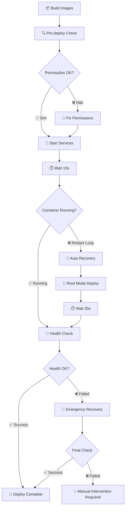

# 🚀 Sistema de Auto-Recovery no Deploy

Este documento explica como o sistema automatizado de detecção e correção de problemas de permissões funciona no GitHub Actions.

## 🔍 Como Funciona

### **1. Detecção Automática de Problemas**
O workflow agora detecta automaticamente:
- ✅ **Restart Loops**: Container backend em loop de reinicialização
- ✅ **Problemas de Permissões**: Diretório `./organized` com UID/GID incorretos
- ✅ **Volume Issues**: Volume Docker com permissões inadequadas
- ✅ **Health Check Failures**: Endpoints não respondendo

### **2. Correção Automática (3 Níveis)**

#### **Nível 1: Correção Preventiva** 🛡️
**Executado sempre antes do deploy:**
```bash
# Verificar e corrigir permissões do diretório host
sudo chown -R 1000:1000 ./organized
sudo chmod -R 755 ./organized

# Corrigir permissões do volume Docker
docker run --rm -v musicas_data:/data alpine chown -R 1000:1000 /data
```

#### **Nível 2: Recovery Automático** 🔄
**Ativado se detectar restart loop:**
```bash
# 1. Para containers
docker compose down

# 2. Ativa modo root temporário
echo "FIX_PERMISSIONS=true" >> .env
docker compose -f docker-compose.fix-permissions.yml up -d

# 3. Aguarda recovery (30s)
# 4. Verifica health check
```

#### **Nível 3: Recovery de Emergência** 🚨
**Ativado se Nível 2 falhar:**
```bash
# 1. Reset completo
docker compose down
docker container prune -f

# 2. Recriar estrutura
sudo rm -rf ./organized
mkdir -p ./organized && sudo chown -R 1000:1000 ./organized

# 3. Deploy com root permanente
docker compose -f docker-compose.fix-permissions.yml up -d

# 4. Verifica health (45s timeout)
```

### **3. Sistema de Retry** 🔁
- ✅ **3 tentativas** de health check
- ✅ **10 segundos** entre tentativas
- ✅ **Logs detalhados** de cada tentativa
- ✅ **Exit gracioso** se todas falharem

---

## 📊 Fluxo de Deploy



---

## 🎯 Benefícios

### **Para o Desenvolvedor:**
- ✅ **Zero Intervenção**: Problemas de permissões são corrigidos automaticamente
- ✅ **Deploy Confiável**: Múltiplas camadas de recovery
- ✅ **Logs Detalhados**: Diagnóstico completo em caso de falha
- ✅ **Rollback Seguro**: Não deixa sistema em estado inconsistente

### **Para Produção:**
- ✅ **Uptime Maximizado**: Recovery automático sem downtime prolongado
- ✅ **Monitoramento**: Health checks contínuos durante deploy
- ✅ **Resiliência**: Funciona mesmo com diferentes configurações de host
- ✅ **Auditoria**: Logs completos de todas as operações

---

## 📋 Logs do Deploy

### **Deploy Bem-Sucedido:**
```
🔍 === Pre-deploy permissions check ===
✅ Directory ./organized exists
✅ Permissions already correct
🚀 Starting services
✅ Backend container is running
✅ Internal health check passed
✅ External health check passed
🎉 === DEPLOY SUCCESSFUL ===
```

### **Recovery Automático:**
```
🚨 RESTART LOOP DETECTED - Attempting automatic recovery
🔧 Step 1: Stopping containers
🔧 Step 2: Using root permissions mode for recovery
🔧 Step 3: Starting with permission fix mode
⏱️ Waiting 30 seconds for recovery...
✅ Backend container is running
✅ Health check passed after recovery
🎉 === DEPLOY SUCCESSFUL ===
```

### **Falha Total:**
```
💥 EMERGENCY RECOVERY FAILED - Manual intervention required

🛠️  MANUAL RECOVERY STEPS:
1. SSH into the server
2. cd to project directory  
3. Run: sudo chown -R 1000:1000 ./organized
4. Run: docker compose down && docker compose up -d
5. Check logs: docker compose logs -f musicas-igreja
```

---

## 🔧 Configuração Manual (Se Necessário)

### **Verificar Status:**
```bash
# Status dos containers
docker compose ps

# Logs detalhados
docker compose logs -f musicas-igreja

# Health check manual
curl http://localhost:5001/health
```

### **Correção Manual:**
```bash
# Parar tudo
docker compose down

# Corrigir permissões
sudo chown -R 1000:1000 ./organized
sudo chmod -R 755 ./organized

# Reiniciar
docker compose up -d
```

---

## ⚡ Vantagens do Novo Sistema

| **Antes** | **Depois** |
|-----------|------------|
| ❌ Manual intervention required | ✅ Auto-recovery |
| ❌ Deploy fails on permission issues | ✅ Auto-fixes permissions |  
| ❌ No diagnostic information | ✅ Detailed logs and diagnostics |
| ❌ Single attempt | ✅ Multiple recovery levels |
| ❌ Unclear failure reasons | ✅ Clear error messages and steps |

---

## 🚀 **Como Usar**

**Simplesmente faça o git push!** O sistema detectará e corrigirá problemas automaticamente.

```bash
git add .
git commit -m "fix: correções de responsividade e permissões"
git push origin main
```

O GitHub Actions vai:
1. ✅ **Detectar** problemas de permissões
2. ✅ **Corrigir** automaticamente  
3. ✅ **Deploy** com sucesso
4. ✅ **Monitorar** health checks
5. ✅ **Recuperar** se necessário

**Não é mais necessário SSH no servidor para corrigir permissões! 🎉**
