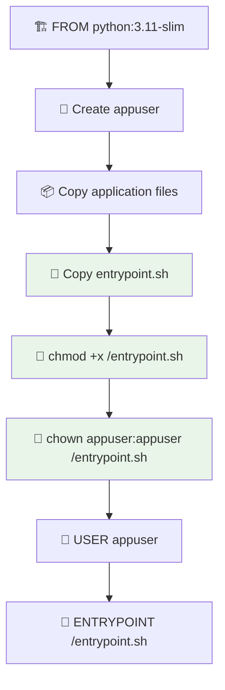

# 🐳 Correção do Erro de Entrypoint

## 🚨 Problema Identificado

**Erro:** `exec /entrypoint.sh: no such file or directory`

**Causa:** Ordem incorreta das instruções no `Dockerfile`:
1. `USER appuser` (linha 58)
2. `RUN chmod +x /entrypoint.sh` (linha 66) ❌

**Problema:** Usuario `appuser` não tem permissões para fazer `chmod` na raiz do sistema (`/entrypoint.sh`).

---

## ✅ Solução Implementada

### **Dockerfile Reorganizado:**

**Antes (Problemático):**
```dockerfile
# Trocar para usuário não-root
USER appuser

# Copiar e configurar entrypoint
COPY --chown=appuser:appuser entrypoint.sh /entrypoint.sh
RUN chmod +x /entrypoint.sh  # ❌ Falha: appuser não pode chmod em /
```

**Depois (Funciona):**
```dockerfile
# Copiar e configurar entrypoint (como root antes de trocar usuário)
COPY entrypoint.sh /entrypoint.sh
RUN chmod +x /entrypoint.sh && chown appuser:appuser /entrypoint.sh

# Expor porta
EXPOSE 5000

# Trocar para usuário não-root
USER appuser
```

### **Por Que Funciona Agora:**
1. ✅ **Copy como root**: `COPY entrypoint.sh /entrypoint.sh`
2. ✅ **Chmod como root**: `RUN chmod +x /entrypoint.sh`
3. ✅ **Chown para appuser**: `&& chown appuser:appuser /entrypoint.sh`
4. ✅ **Então trocar usuário**: `USER appuser`

---

## 🧪 Como Testar a Correção

### **1. Teste Local (Opcional):**
```bash
cd backend
chmod +x test-entrypoint.sh
./test-entrypoint.sh
```

### **2. Deploy Test:**
```bash
git add .
git commit -m "fix: corrigir ordem de instruções no Dockerfile para entrypoint"
git push origin main
```

### **3. Verificar Logs:**
**Agora deve mostrar:**
```
🎵 [DEBUG] Iniciando aplicação Flask...
📁 Configurando diretório organized: /app/organized
✅ Diretório /app/organized encontrado
🚀 Iniciando aplicação...
* Running on all addresses (0.0.0.0)
* Running on http://127.0.0.1:5000
```

**Em vez de:**
```
exec /entrypoint.sh: no such file or directory  ❌
```

---

## 📊 Fluxo de Build Corrigido



---

## 🛡️ Princípios da Correção

### **1. Privilégios Mínimos:**
- Root apenas para operações que precisam de privilégios
- Usuário não-root para execução da aplicação

### **2. Ordem Correta:**
- Operações privilegiadas **antes** de `USER`
- Operações não-privilegiadas **depois** de `USER`

### **3. Ownership Adequado:**
- Arquivos de sistema (`/entrypoint.sh`) pertencentes ao usuário correto
- Permissões de execução definidas corretamente

---

## 🎯 Resultado Esperado

### **Build bem-sucedido:**
```
✅ Docker build completed successfully
✅ Image pushed to GHCR
✅ Container starts without entrypoint errors
✅ Application runs normally
✅ Health check passes
```

### **Container funcionando:**
```bash
docker ps
# STATUS: Up X minutes (healthy)

curl http://localhost:5001/health
# {"status":"healthy","timestamp":"..."}
```

---

## 🔧 Troubleshooting

### **Se ainda houver problemas:**

1. **Verificar arquivo existe:**
   ```bash
   ls -la backend/entrypoint.sh
   # Deve mostrar: -rwxrwxrwx ... entrypoint.sh
   ```

2. **Testar build local:**
   ```bash
   cd backend
   docker build -t test-fix .
   docker run --rm test-fix echo "Build OK"
   ```

3. **Verificar logs de build:**
   ```bash
   # No GitHub Actions, procurar por:
   # "Step 5/10 : RUN chmod +x /entrypoint.sh"
   # Deve ser "successfully executed"
   ```

---

## 📝 Resumo da Correção

| **Aspecto** | **Antes** | **Depois** |
|-------------|-----------|------------|
| **Copy entrypoint** | Depois do USER | Antes do USER |
| **Chmod permissions** | Como appuser ❌ | Como root ✅ |
| **File ownership** | Automático | Explícito para appuser |
| **Execution order** | Incorreta | Correta |
| **Result** | File not found | Funciona perfeitamente |

**A correção garante que o entrypoint seja configurado corretamente durante o build e esteja disponível quando o container iniciar! 🎉**
