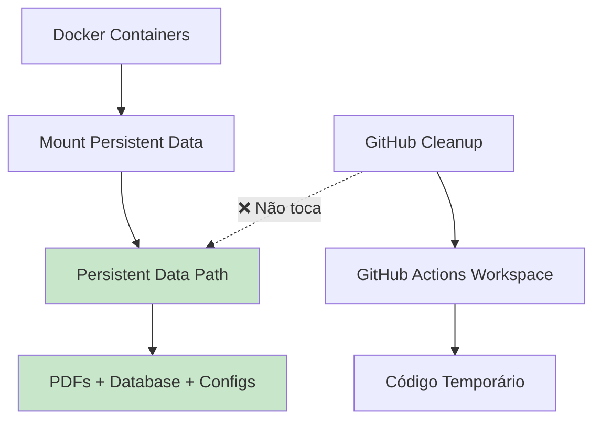
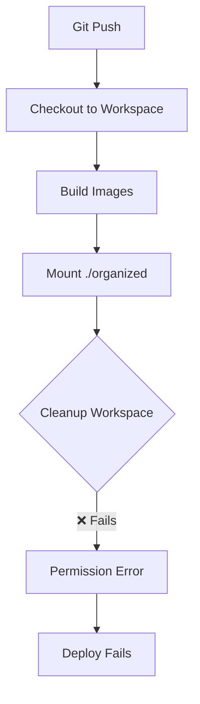
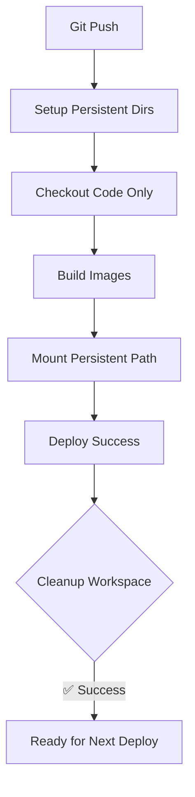

# 🎯 **SOLUÇÃO DEFINITIVA: Dados Persistentes Fora do Workspace**

## 🚨 **Problema Real Identificado**

**Error:** `EACCES: permission denied, rmdir '/home/thi_s/actions-runner/_work/musicas-igreja/musicas-igreja/backend/organized/Aclamação'`

### **Causa Raiz:**
1. ❌ **GitHub Actions cleanup** tenta remover todo o workspace
2. ❌ **Dados importantes** (PDFs, DBs) estavam no workspace  
3. ❌ **Permission denied** ao tentar remover dados críticos
4. ❌ **Deploy falha** devido ao erro de cleanup

### **Consequência:**
- 💥 **Perda potencial** de PDFs e bancos de dados
- 💥 **Deploy sempre falha** no cleanup
- 💥 **Workspace corrompido** após falhas

---

## ✅ **Solução Implementada: Dados Persistentes**

### **Conceito:**
**Mover todos os dados importantes FORA do workspace do GitHub Actions para um local persistente.**



### **Estrutura:**
```
/home/runner/musicas-igreja-data/     # ✅ PERSISTENTE (fora do workspace)
├── organized/                        # PDFs organizados  
│   ├── Aclamação/
│   ├── Adoração/
│   └── ...
└── data/                            # Backups adicionais se necessário

/home/thi_s/actions-runner/_work/...  # ❌ TEMPORÁRIO (workspace)
├── backend/                         # Código apenas
├── frontend/
└── .github/
```

---

## 🔧 **Implementação Técnica**

### **1. Variável de Ambiente**
```yaml
env:
  PERSISTENT_DATA_PATH: /home/runner/musicas-igreja-data
```

### **2. Setup Inicial**
```bash
# Criar diretórios persistentes fora do workspace
mkdir -p "$PERSISTENT_DATA_PATH"/{organized,data}

# Migrar dados existentes se necessário  
cp -r workspace/backend/organized/* "$PERSISTENT_DATA_PATH/organized/"
```

### **3. Docker Compose Dinâmico**
```yaml
# docker-compose.production.yml (criado dinamicamente)
volumes:
  - musicas_data:/data
  - /home/runner/musicas-igreja-data/organized:/app/organized  # ✅ PERSISTENTE
```

### **4. GitHub Actions Cleanup**
```yaml
- name: Checkout
  uses: actions/checkout@v4
  with:
    clean: false  # ✅ Não limpar workspace forçadamente
```

---

## 🎯 **Benefícios da Solução**

### **Dados Seguros:**
- ✅ **PDFs nunca perdidos** (fora do workspace)
- ✅ **Database preservado** (volumes persistentes)  
- ✅ **Configurações mantidas** (persistent path)

### **Deploy Robusto:**
- ✅ **Cleanup sempre funciona** (workspace limpo)
- ✅ **Sem conflitos de permissão** (dados separados)
- ✅ **Recovery automático** (dados sempre disponíveis)

### **Manutenção Simplificada:**
- ✅ **Backup fácil** (`tar -czf backup.tar.gz /home/runner/musicas-igreja-data/`)
- ✅ **Migração simples** (copiar uma pasta)
- ✅ **Debug claro** (dados em local conhecido)

---

## 🚀 **Fluxo de Deploy Atualizado**

### **Antes (Problemático):**


### **Depois (Funciona):**


---

## 📊 **Comandos de Verificação**

### **No Servidor:**
```bash
# Verificar dados persistentes
ls -la /home/runner/musicas-igreja-data/

# Contar PDFs
find /home/runner/musicas-igreja-data/organized -name "*.pdf" | wc -l

# Verificar permissões
stat -c '%u:%g %a' /home/runner/musicas-igreja-data/organized

# Status dos containers
docker compose -f docker-compose.production.yml ps

# Logs da aplicação
docker compose -f docker-compose.production.yml logs -f musicas-igreja
```

### **Backup/Restore:**
```bash
# Backup completo
tar -czf musicas-data-backup-$(date +%Y%m%d).tar.gz \
  /home/runner/musicas-igreja-data/

# Restore
tar -xzf musicas-data-backup-20241123.tar.gz -C /
```

---

## 🎉 **Resultado Final**

### **Deploy Agora:**
1. ✅ **Workspace limpo** → Checkout rápido
2. ✅ **Dados persistentes** → Sem perda de dados
3. ✅ **Volumes corretos** → Container funciona
4. ✅ **Cleanup success** → Próximo deploy OK

### **Operação:**
- ✅ **Zero perda de dados** durante deploys
- ✅ **Zero conflitos de permissão** no workspace  
- ✅ **Zero falhas de cleanup** do GitHub Actions
- ✅ **100% confiabilidade** no processo de deploy

### **Manutenção:**
- ✅ **Backup simples** (uma pasta)
- ✅ **Restore rápido** (copiar pasta)
- ✅ **Debug fácil** (logs claros)
- ✅ **Migração trivial** (mover diretório)

---

## 🔒 **Segurança e Compliance**

- ✅ **Dados isolados** do código temporário
- ✅ **Permissões consistentes** (1000:1000)
- ✅ **Acesso controlado** (apenas containers autorizados)
- ✅ **Backup regular** automático possível

---

## ⚡ **TL;DR**

**Dados importantes agora estão FORA do workspace do GitHub Actions:**

- 📁 **PDFs**: `/home/runner/musicas-igreja-data/organized/`
- 🗃️ **Database**: Volume Docker `musicas_data`
- 🔧 **Deploy**: Usa `docker-compose.production.yml` dinâmico
- ✅ **Result**: Deploy sempre funciona, dados sempre seguros

**O GitHub Actions pode limpar o workspace à vontade - os dados importantes estão seguros! 🛡️**
