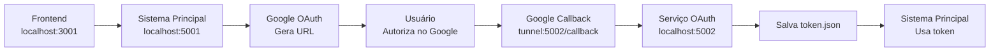

# 🔐 Configuração OAuth Google Drive

Este guia explica como configurar uma porta separada para callbacks OAuth do Google Drive, permitindo que apenas o endpoint de callback seja exposto publicamente.

## 🎯 Cenário de Uso

Você quer:
- ✅ Manter o sistema principal em uma porta privada (5001)
- ✅ Expor apenas o callback OAuth em uma porta pública (5002)
- ✅ Usar tunnel (ngrok, cloudflare, etc.) apenas para OAuth
- ✅ Maior segurança isolando o callback

## ⚙️ Configuração

### 1. Variáveis de Ambiente

Crie um arquivo `.env` com as configurações OAuth:

```bash
# Porta separada para callback OAuth
OAUTH_CALLBACK_PORT=5002

# Host para callback OAuth (ajuste conforme seu tunnel)
OAUTH_CALLBACK_HOST=http://localhost
# Para produção: https://seu-dominio.com
# Para ngrok: https://abc123.ngrok.io

# Chave secreta (mesma do serviço principal)
SECRET_KEY=musicas-igreja-secret-key-2024
```

### 2. Opções de Deployment

#### Opção A: Serviço Principal + OAuth Separado
```bash
# Iniciar ambos os serviços
docker-compose --profile oauth up -d

# Resultado:
# - musicas-igreja (porta 5001) - Sistema principal
# - musicas-oauth (porta 5002) - Apenas callback OAuth
```

#### Opção B: Apenas Sistema Principal (Porta Única)
```bash
# Usar apenas uma porta com callback customizado
export OAUTH_CALLBACK_PORT=5002
docker-compose up -d

# O sistema principal usará a porta configurada para callbacks
```

#### Opção C: Apenas Serviço OAuth
```bash
# Apenas o serviço OAuth (útil para debug)
docker-compose up -d musicas-oauth
```

### 3. Configuração do Tunnel

#### Usando ngrok:
```bash
# Para serviço separado (porta 5002)
ngrok http 5002

# Para sistema principal com callback customizado
ngrok http 5001
```

#### Usando Cloudflare Tunnel:
```bash
# Para porta específica
cloudflared tunnel --hostname oauth.seu-dominio.com --url http://localhost:5002

# Para sistema principal
cloudflared tunnel --hostname app.seu-dominio.com --url http://localhost:5001
```

### 4. Google Cloud Console

Configure no Google Cloud Console:

1. **Acesse:** [Google Cloud Console](https://console.cloud.google.com/)
2. **Navegue:** APIs & Services > Credentials
3. **Edite** seu OAuth 2.0 Client ID
4. **Adicione Redirect URI:**

**Para serviço separado:**
```
https://abc123.ngrok.io/api/google-drive/callback
```

**Para sistema principal:**
```
https://def456.ngrok.io/api/google-drive/callback
```

## 🔧 Como Funciona

### Fluxo OAuth com Porta Separada



### Logs de Configuração

Quando configurado corretamente, você verá nos logs:

```
🔗 [OAUTH] Usando callback customizado: http://localhost:5002/api/google-drive/callback
🔗 [CALLBACK] Usando callback customizado: http://localhost:5002/api/google-drive/callback
```

## 🚨 Troubleshooting

### Erro: redirect_uri_mismatch
- ✅ Verifique se a URI no Google Cloud Console está correta
- ✅ Confirme se o tunnel está apontando para a porta correta
- ✅ Verifique os logs para ver qual URI está sendo usada

### Callback não funciona
```bash
# Verificar se o serviço OAuth está rodando
curl http://localhost:5002/health

# Verificar logs
docker-compose logs musicas-oauth

# Testar callback manualmente
curl http://localhost:5002/api/google-drive/callback
```

### Token não é compartilhado
O `token.json` é salvo em volume compartilhado, então ambos os serviços têm acesso:
```bash
# Verificar se token existe
docker-compose exec musicas-igreja ls -la /app/token.json
docker-compose exec musicas-oauth ls -la /app/token.json
```

## 📋 Comandos Úteis

```bash
# Verificar configuração atual
docker-compose config

# Ver apenas variáveis OAuth
docker-compose config | grep OAUTH

# Logs específicos do OAuth
docker-compose logs -f musicas-oauth

# Reiniciar apenas OAuth
docker-compose restart musicas-oauth

# Parar serviço OAuth
docker-compose stop musicas-oauth

# Remover serviço OAuth
docker-compose rm musicas-oauth
```

## 🔒 Segurança

### Benefícios da Porta Separada:
- ✅ **Isolamento**: Sistema principal não fica exposto
- ✅ **Controle**: Apenas callback OAuth é público
- ✅ **Flexibilidade**: Tunnel apenas para OAuth
- ✅ **Monitoramento**: Logs separados para OAuth

### Recomendações:
- 🔐 Use HTTPS em produção
- 🔄 Monitore logs de ambos os serviços
- 🔒 Configure firewall para permitir apenas as portas necessárias
- 📝 Documente as URIs configuradas no Google Console

---

**🎵 OAuth configurado com segurança e flexibilidade!**
